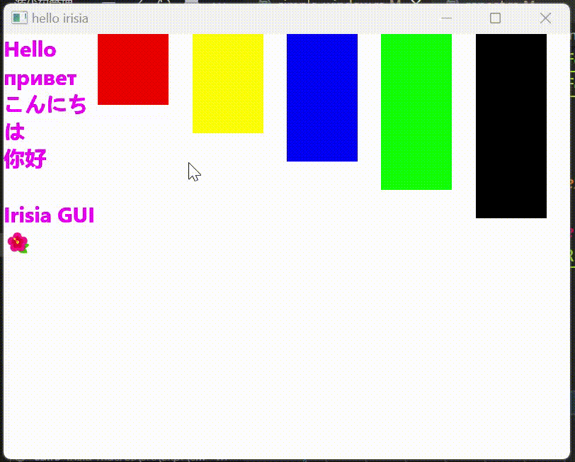

# Irisia GUI

- [Irisia GUI](#irisia-gui)
- [简介](#简介)
  - [什么是GUI框架](#什么是gui框架)
  - [为什么选择Rust](#为什么选择rust)
  - [为什么选择Irisia](#为什么选择irisia)
- [体验Irisia](#体验irisia)
  - [速览显示效果](#速览显示效果)
  - [亲自动手试试](#亲自动手试试)
- [Irisia Book](#irisia-book)
- [目前进度](#目前进度)
  - [大纲](#大纲)
  - [待解决的问题](#待解决的问题)
- [贡献代码](#贡献代码)

目前更新分支：`spec-field-upd-at-rt`

# 简介

Irisia GUI是一个基于Rust程序设计语言的GUI框架。

Irisia重点依赖于下列几个开源库

- [winit](https://crates.io/crates/winit)：Rust语言最广泛使用的窗口启动框架，具有良好的跨平台性，支持主流操作系统，也可移植到移动端。
- [skia-safe](https://crates.io/crates/skia-safe)：[Skia](https://skia.org/)的Rust绑定。Skia是一款由Google开发的基于C++的开源图形库，现作为Chrome浏览器、Edge浏览器和Android系统的渲染后端，具有强大的呈现能力。
- [tokio](https://crates.io/crates/tokio)：强大的异步框架，具有多线程执行器、任务调度等能力，是Irisia事件系统的后端。
  
## 什么是GUI框架

GUI框架是介于绘制图案（类似海龟画图）和系统，与业务逻辑之间的粘合剂。GUI框架是一种面向开发人员的工具，能够帮助开发人员快速开发出具有表达力界面的应用程序。您所使用的任何带有界面（例如按钮、文本、图片等等）的应用程序，包括正在协助您浏览本文档的浏览器，都有GUI框架的身影，它们绘制出精美的图案呈现给您拱您阅读和交互。

如果没有GUI框架，那么人们需要通过繁琐的逻辑让程序捕捉您的键盘输入、手指触摸等，再通过类似海龟画图的方式将内容画出来。这样一来极大地增加了逻辑的复杂度，从而产生大量漏洞，也使得编程目标不明确。或者使用传统的命令行（黑底白字的窗口）取而代之，但这极其不适合非计算机领域人群使用。

## 为什么选择Rust

Rust是一门第一次发布于2015年的程序设计语言，在Stack Overflow平台上占据了连续6年以上程序员最喜欢的语言排行榜首，Windows和Linux系统正在引入Rust语言来重写一部分高风险模块。

Rust的应用场景很广泛，可以通过WebAssembly技术在浏览器运行，也可以通过交叉编译，脱离系统在单片机里运行。可以做出拥有好看界面的网购程序，也可以在云主机上参与区块链运行。

人们喜欢它并不是没有理由的。Rust包括但不限于以下几个优势：
1. 高性能。因为没有垃圾收集（GC），也没有运行时，因此具有与C++相媲美的性能。这使得其适合操作系统和单片机编程。
2. 和C/C++的完全粘合性。Rust和clang/clang++编译期的编译后端都是LLVM，因此Rust可以十分轻松地调取C/C++的动态链接库，甚至C/C++还可以反过来调取Rust的库。
3. 跨平台性。虽然它没有虚拟机，需要交叉编译到各个平台，但好在Rust的交叉编译能力十分强大，编译后便可直接在目标机器运行，不需要安装任何东西。这大大提升了用户的体验。
4. 高开发效率。Rust有非常多创新语法，例如模式匹配、带类型枚举和类型推导，这使得Rust具有更强的表达能力。
5. 元编程。宏可谓是Rust的一大特色，Irisia大大利用了这一特点。利用宏，库开发者可以轻松地自定义出各种语法，让使用者以更简单的方式达到目的。
6. 严格意义上的100%内存安全性。Rust利用所有权系统保证了内存安全性。只要您使用您信任的库（尤其是标准库），不使用不安全代码，那就不可能出现内存安全问题。如果出现了内存错误，那就是库开发者的过错！
7. 优秀的构建工具和包管理器。受够了依赖版本问题？受够了只在自己机器才能运行？受够了手动编译？那就试试Rust的包管理器Cargo吧。在您编译Irisia的时候，您会亲身体验到的。

欲了解详情请移步[Rust官网](https://www.rust-lang.org/zh-CN/)。

## 为什么选择Irisia

1. 作为Irisia的创始人，截至我撰写文档已经有5年编程经验，前几年在前端活跃，Irisia的灵感也来源于前端框架。我最拿手的框架是Vue，同时也学习过React。Vue和React都是非常优秀且得到广泛认可的前端框架，我从中汲取了很多Irisia的设计模式。因此，我是以前端框架的要求来严格要求Irisia的质量的。
2. 脱离编译恐惧。十分感谢`skia-safe`提供了预编译包，用户不需要手动编译Skia。安装好Rust必要的工具链后，只需执行`cargo b`就能生成出一份可执行文件。
3. Irisia大大利用了Rust的元编程模式，拥有Irisia特有的过程宏`build!`和`style!`，通过特有的语法来协助开发者快速开发出自己需要的界面。除此之外，也有许多派生宏，可供开发者设计各式各样的组件。
4. 高度自由。在Irisia，没有内幕元素，`irisia0-widgets`中所有组件包括文本框都是利用公共API做的。用户可以自定义元素属性、样式、动画、布局、渲染顺序等等。
5. 不同于现有的生态，Irisia使用的图形库是Skia。由于长时间的积淀和Google做背书，Skia的呈现能力大大超过Rust目前的图形库，这也使得Irisia更具有潜力开发出精美的界面。
6. 异步事件系统。Irisia不再局限于传统的回调事件方式，在需要监听多个事件完成的复杂业务中有效避免了回调地狱（Callback Hell）问题，同时利用Rust的异步语法大大降低了开发难度。不过我们认为回调的形式在简单场景仍是有意义的，因此Irisia做了保留和改进，设计出了更适合Rust的模式，供开发者根据业务难度自由选择。
7. Irisia的缓存模型采用了分层渲染模式，隔离出高频渲染部分（通常是带动画的元素），最后通过合成图层来获得最终图像。利用这种方式，在大大节省性能的同时也节省了电源使用，更适合长时间续航。
8. Irisia会监听元素属性变化，在属性更新时才会重新渲染。在静息状态下，除用户元素刻意为之，Irisia的窗口刷新率为0，占用极少CPU和GPU资源（在Windows系统任务管理器中显示占用都为0%）。

# 体验Irisia

## 速览显示效果

```rust
use irisia::{
    application::Window,
    build,
    element::{Element, ElementUpdate},
    event::standard::{CloseRequested, PointerDown},
    skia_safe::Color,
    style,
    style::StyleColor,
    ElModel,
};
use irisia_widgets::textbox::{
    styles::{StyleFontSize, StyleFontWeight},
    TextBox,
};
use window_backend::{Flex, Rectangle, StyleHeight, StyleWidth};

mod window_backend;

#[irisia::main]
async fn main() {
    Window::new::<App>("hello irisia")
        .await
        .unwrap()
        .join()
        .await;
}

struct App {
    rects: Vec<Option<Color>>,
}

impl Element for App {
    type BlankProps = ();

    fn set_children(&self, this: &ElModel!()) {
        this.set_children(build! {
            Flex {
                TextBox {
                    text: "Hello\nпpивeт\nこんにちは\n你好\n\nIrisia GUI🌺",
                    user_select: true,
                    +style: style! {
                        if 1 + 1 == 2 {
                            color: Color::MAGENTA;
                        }
                        font_weight: .bold;
                        font_size: 30px;
                    }
                }

                for (index, color) in self.rects.iter().enumerate() {
                    @key index;
                    if let Some(color) = color {
                        Rectangle {
                            +style: style! {
                                width: 100px;
                                height: 100px + 40px * index as f32;
                                color: color.clone();
                            },
                            +oncreate: move |em| {
                                rect_rt(this, em, index);
                            },
                        }
                    }
                }
            }
        })
        .layout_once(this.draw_region())
        .unwrap();
    }
}

impl ElementUpdate<()> for App {
    fn el_create(this: &ElModel!(), _: ()) -> Self {
        this.global()
            .event_dispatcher()
            .listen()
            .no_handle()
            .spawn(|cr: CloseRequested| {
                println!("close requsted");
                cr.0.close();
            });

        Self {
            rects: vec![
                Some(Color::RED),
                Some(Color::YELLOW),
                Some(Color::BLUE),
                Some(Color::GREEN),
                Some(Color::BLACK),
            ],
        }
    }

    fn el_update(&mut self, _: &ElModel!(), _: (), _: bool) -> bool {
        true
    }
}

fn rect_rt(this: &ElModel!(App), rect: &ElModel!(Rectangle), index: usize) {
    println!("rectangle {index} got");
    let this = this.clone();
    rect.listen()
        .trusted()
        .no_handle()
        .once()
        .asyn()
        .spawn(move |_: PointerDown| async move {
            println!("rectangle {} deleted", index);
            this.el_write().await.unwrap().rects[index].take();
        });
}

```



## 亲自动手试试

下面是运行例子中简单窗口的命令
```sh
git clone https://github.com/Fancyflame/irisia-gui.git
cd irisia-gui
cargo r --example simple_window
```
**如果遇到编译错误，请查阅[Irisia Book](#irisia-book)！**

# Irisia Book

目前只有中文可用
<https://fancyflame.github.io/irisia-gui/>

# 目前进度

**Irisia GUI正处于快速开发阶段，文档、接口和示例很可能不能反应最新进度。欲获知最新特性，可参考`windows.rs`文件。**

## 大纲

- [x] 可行性测试
- [x] `build` 和 `style` 宏
- [x] 搭建后端支持（`skia`和`winit`）
- [x] 文本渲染
- [x] 缓存模型（独立渲染层、合成层）
- [ ] 设计组件（按钮、复选框等）
- [ ] 文档撰写
- [ ] 预发布（Windows版本）
- [ ] 动画系统（基于Style）
- [ ] 支持更多平台

## 待解决的问题

- [ ] 取消元素不能持有读写锁进入pending状态的限制
- [ ] 预制派生事件(SubEvent)

# 贡献代码

可以发一份邮件到我的邮箱<fancyflame@163.com>联系我。感谢您愿意贡献您的力量！
