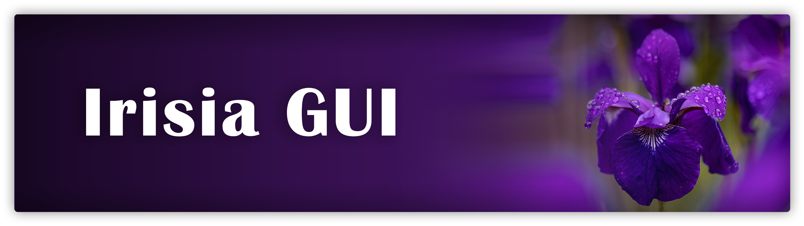
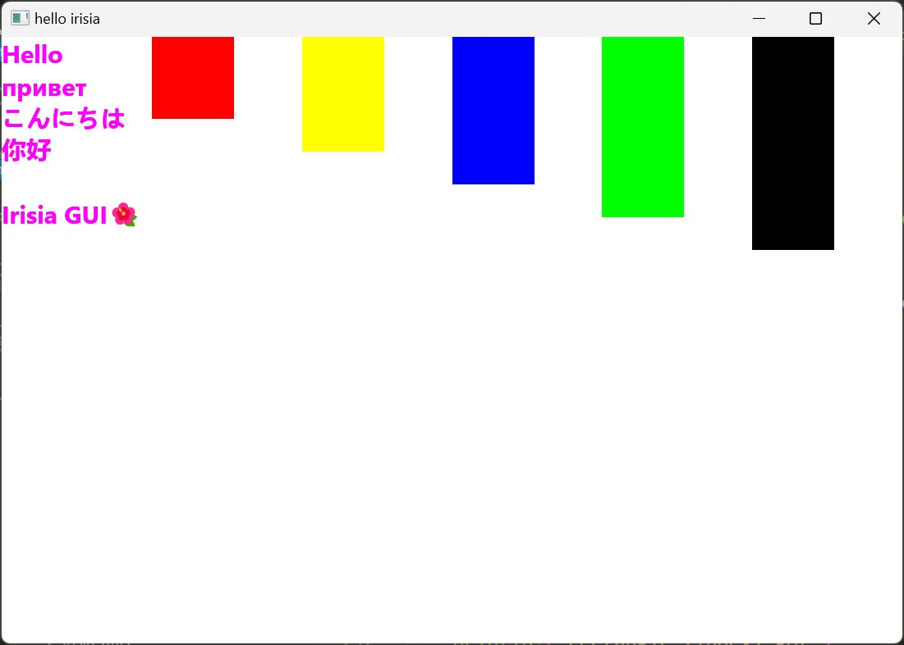

# Irisia GUI

Irisia GUI is a GUI framework based on Rust programming language, featured high-performance, cross-platform, flexible, empowers everyone to build an morden applications with accuracy and efficiency.

Irisia is heavily depend on following crates:

- [winit](https://crates.io/crates/winit): A window launcher, which is widely used in Rust.
- [skia-safe](https://crates.io/crates/skia-safe): Bindings to [Skia](https://skia.org/). Skia is a graphics library developed by Google, used by lots of project, most famously Chrome and Android.
- [tokio](https://crates.io/crates/tokio): A asynchronous library with runtime and useful utils, which is high-speed and reliable.

## Take a quick look

A simple window application is looks like following. Newest examples please take a look at
[examples](https://github.com/Fancyflame/irisia-rs/tree/main/examples) directory.

```rust
#[irisia::main]
async fn main() {
    irisia::new::<App>("test".into()).await.unwrap().join().await;
}

struct App {
    rects: Vec<Color>,
}

impl Default for App {
    fn default() -> Self {
        Self {
            rects: vec![
                Color::RED,
                Color::YELLOW,
                Color::BLUE,
                Color::GREEN,
                Color::BLACK,
            ],
        }
    }
}

impl Element for App {
    type Props<'a> = NoProps;
    type ChildProps<'a> = NeverInitalized;

    irisia::render_fn! {
        @init(self);
        Flex {
            TextBox {
                text: "hello世界🌏",
                +style: style!{
                    color: Color::MAGENTA;
                    font_slant: .normal;
                    font_size: 50px;
                }
            }

            for (index, color) in self.rects.iter().enumerate() {
                @key index;
                Rectangle {
                    +id: ("rect", index),
                    +style: style!{
                        width: 100.0;
                        height: 100.0 + 40.0 * index as f32;
                        color: color.clone();
                    }
                }
            }
        }
    }

    fn start_runtime(init: RuntimeInit<Self>) {
        tokio::spawn(async move {
            loop {
                let event = init.event_dispatcher.recv_sys::<WindowEvent>().await;

                match event {
                    WindowEvent::MouseInput {
                        button: MouseButton::Left,
                        state: ElementState::Pressed,
                        ..
                    } => {
                        println!("left click");
                    }
                    _ => {}
                }
            }
        });
    }
}
```



## About English Documentation

- We are sorry but English documentation is not available now. We will add as soon as possible.
- How about take a look at [`window`](https://github.com/Fancyflame/irisia-rs/blob/main/examples/window.rs) example?
- If you tend to translate the documentation into English, please feel free to open an issue. Thanks a lot.

## Irisia Book

Only Chinese is available now :/\
目前只有中文可用\
👇

<https://fancyflame.github.io/irisia-rs/>
