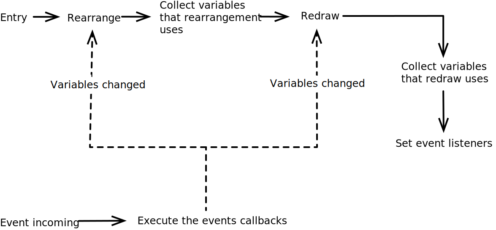

# Cream-rs 架构
这是Cream库的架构文档。

## 总览

#### 宏
用户通过宏来创建App
```rust
cream::global_style!{
    pub struct GlobalStyle = {
        background: rgb4285f4
    };
}

cream::component!{
    sig: "pub struct MyApp",

    props:{
        name: &'static str,
        first: u32,
        second: u32,
    }

    data: {
        pub global_style: GlobalStyle,
    }

    methods: {
        pub fn swap<T>(a: &mut T, b: &mut T){
            ::std::mem::swap(a, b);
        }

        #[cream(watch)]
        fn name(&self) {
            println!("name changed to `{}`", self.name());
        }

        #[cream(watch = "first")]
        fn first_renamed(&mut self) {
            self.second_mut() = self.first + 10;
        }

        #[cream(render)]
        fn render(&mut self){
            cream::render!{
                Element1(arg1, arg2, arg3){
                    .style: {
                        width: 10px,
                        height: 100pct,
                        color: green,
                    },
                    .id: "elem1",
                    &optional_arg_name1: expr,
                    &optional_arg_name2: expr,

                    Element2(arg1, arg2)

                    Element2{
                        .style: {
                            .extend: [self.global_style()]
                        },
                        0: arg1,
                        1: arg2
                    },

                    Element3{
                        namex: expr,
                    },

                    Element4
                },
            }
        }
    }
}
```

## 工作流程


## 目录
目录的每个模块都相互关联，因此没有对它们进行重要程度排序。如果要掌握整个库的架构，建议您全部浏览一遍。

- [渲染器](renderer.md)
- 组件管理器
  - [概述](comp_mngr/summary.md)
  - 事件监听器
  - 子节点缓存顺序和插槽
- 元素
  - [概述](element/summary.md)
  - [响应式数据](element/data_and_props.md)
  - [计算值](element/computed.md)
  - [样式](element/style.md)
  - watch和event
  - 渲染
  - 宏
- 样式
   - 概述
   - 组件内样式宏
   - 全局样式宏
- 后端