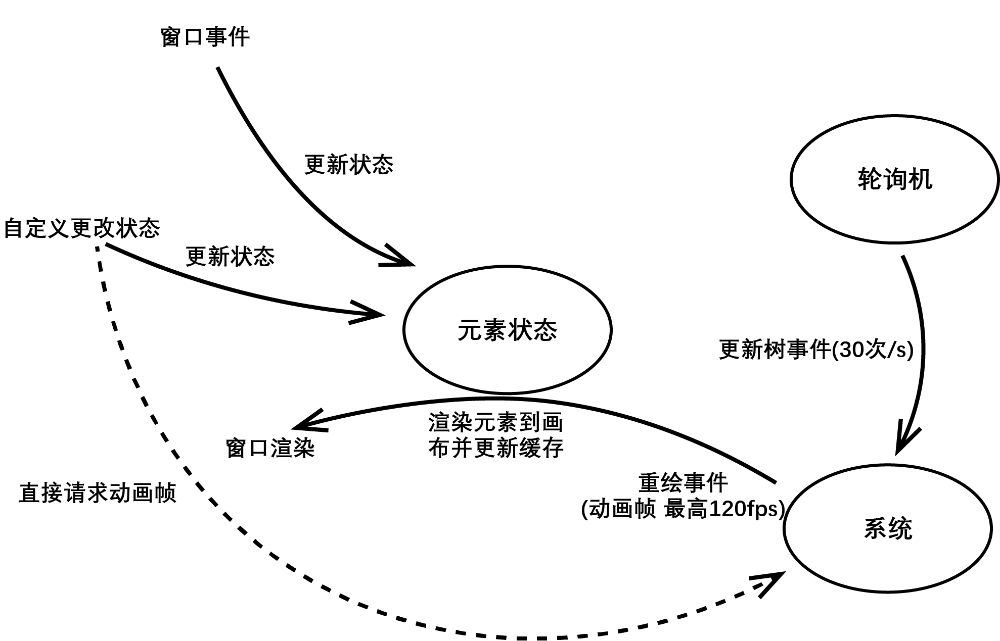

# 设计原理

学习Irisia GUI的设计理念有助于您理解Irisia GUI。

## main函数

下图展示了一个Irisia程序的入口函数工作例程。
```text
程序开始 -> 启动运行时 -> 创建窗口 ------ ----> 退出
                            ^         |
                            |---------
```
很简单，对吧？

main函数要做的工作就是创建一个或多个窗口，然后等待窗口关闭，最后退出。在这里没有什么要点。

## 渲染周期

当一个窗口初始化完成后，需要提供一个根元素，然后进入第一个渲染周期，循环。
一个窗口会接收3种事件：
1. 更新树事件：以30次每秒速度触发。当接收到该事件后，会重构结点树，检查缓存。如果元素更新缓存，则向窗口请求重绘。
2. 重绘事件：最高以120fps更新，取决于计算机性能。当更新节点树事件检查到更改后，会请求重绘。同时含动画元素也可以申请动画帧（animation frame），而独立于更新树事件，达到更流畅的动画效果。
3. 窗口事件：鼠标事件、键盘事件等。它可以以高于120fps的速度刷新，取决于当前电子设备的硬件。

